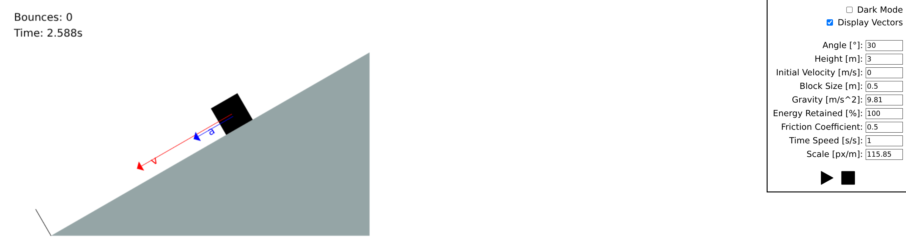
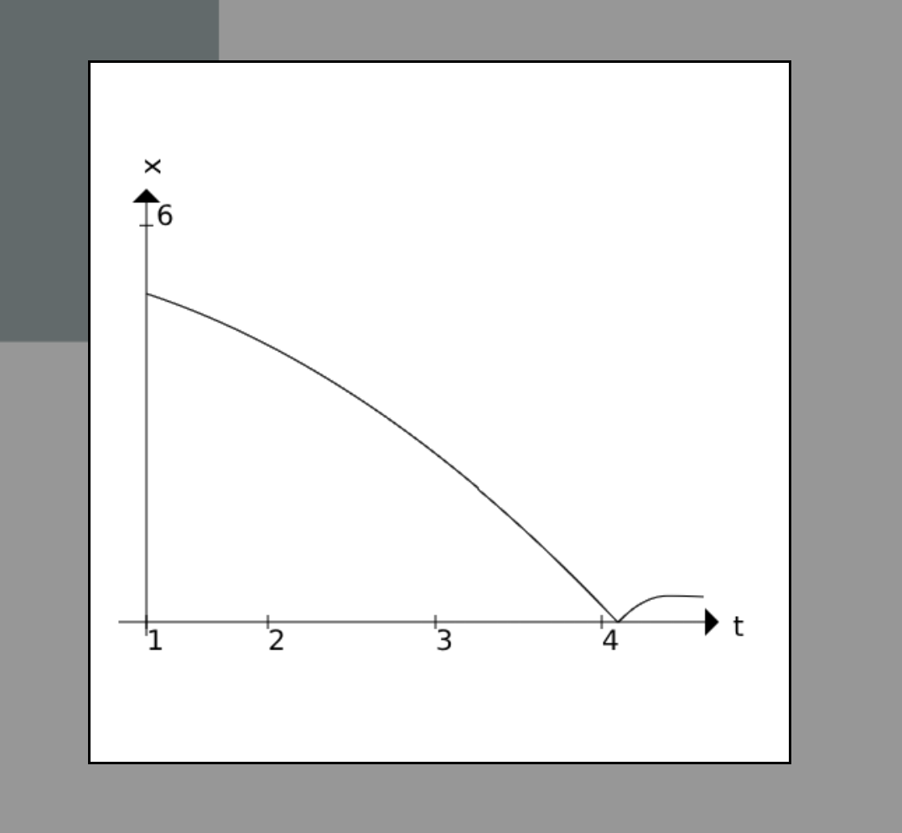
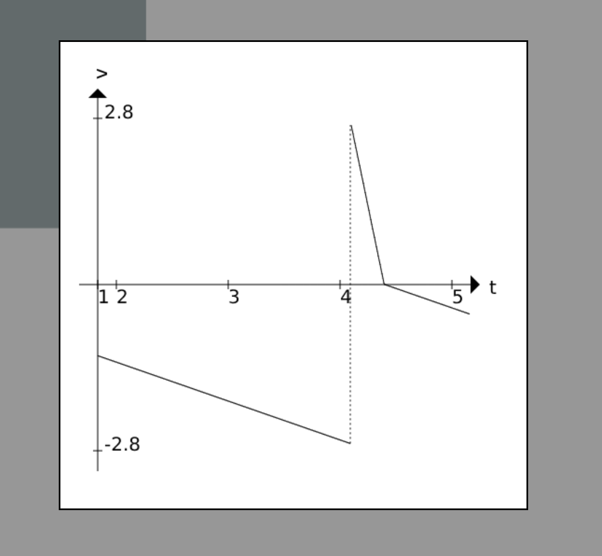

# Inclined Plane Physics Simulation

A physics simulation of a block sliding on an inclined plane, built with vanilla JavaScript and HTML5 Canvas.

<div align="center">
  
</div>

<div align="center">
  
  
</div>

## Live version
Check out the [live version](https://rownia-pochyla.netlify.app/)!

## Features

- **Interactive Simulation**: Adjust angle, height, friction, initial velocity, and more.
- **Real-time Graphs**: Monitor Position, Velocity, and Acceleration over time.
- **Visualizations**: View velocity and acceleration vectors on the block.

## Getting Started

### Prerequisites

You need a modern web browser that supports ES Modules.

### Running the App

Simply open `index.html` in your browser.

```bash
# Or using a local server (recommended)
npx serve .
```

### Running Tests

This project uses `vitest` for testing.

1. Install dependencies:
   ```bash
   npm install
   ```
2. Run tests:
   ```bash
   npm test
   ```

## Physics Model

The simulation uses standard kinematic equations for uniform acceleration on an inclined plane. Physics equations are implemented in [motion.js](motion.js) file.

Given the acceleration (which remains constant while moving in a single direction, calculated from gravitational and frictional forces), the task is to determine the block's position at every frame. Generally, there are two ways to simulate this. The first is numerical integration, which approximates position and velocity iteratively each frame. The second is to use analytical solutions (derived equations of motion) to calculate these values directly for any given time. While this project uses the latter, analytical solutions can become increasingly difficult to implement in more complex scenarios (for example: the double pendulum).
